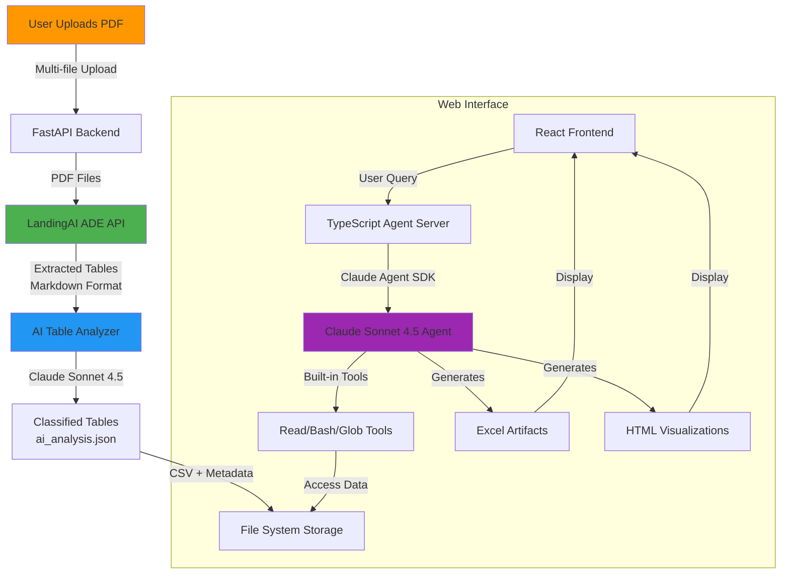

# FinForge AI - AI-Driven Financial Document Analysis

> **Submission for Financial AI Hackathon Championship - 2025**
> An intelligent financial document extraction and analysis system powered by LandingAI and Claude Agent SDK

## Overview

FinForge AI is a complete end-to-end system that transforms complex financial PDF documents into interactive Excel reports and visualizations using multi-stage AI processing. The system combines LandingAI's Advanced Document Extraction (ADE) with Claude's Agent SDK to provide an intelligent, conversational interface for financial analysis.

**Demo Video**: [https://www.youtube.com/watch?v=gccDz-vPghs]

## Why LandingAI?

**LandingAI's Advanced Document Extraction (ADE) is mandatory for this system** because:

1. **Handles Picture-based PDFs**: Many financial statements are scanned documents or image-based PDFs, not text-based PDFs
2. **Complex Table Structures**: Financial statements contain nested tables, multi-column layouts, and multi-language content
3. **Large File Processing**: Enterprise financial reports can be 50+ pages with hundreds of tables
4. **Accuracy**: LandingAI's specialized table extraction models significantly outperform generic OCR solutions

Traditional PDF parsers (PyPDF, pdfplumber) fail on image-based PDFs. LandingAI ADE solves this fundamental limitation.

## System Architecture



## Processing Pipeline

### Stage 1: PDF Upload & Extraction
1. **User uploads financial PDFs** (picture-based or text-based)
2. **FastAPI receives files** and forwards to LandingAI ADE
3. **LandingAI extracts tables** using computer vision + LLM
4. **Output**: Markdown files with structured table data

### Stage 2: AI-Powered Table Classification
1. **AI Table Analyzer** reads extracted markdown
2. **Claude Sonnet 4.5** classifies each table:
   - Balance Sheet (งบแสดงฐานะการเงิน)
   - Profit & Loss Statement (งบกำไรขาดทุน)
   - Cash Flow Statement (งบกระแสเงินสด)
   - Fixed Assets Schedule (ทะเบียนทรัพย์สิน)
   - And more...
3. **Output**: `ai_analysis.json` + individual CSV files

### Stage 3: Conversational AI Analysis
1. **User asks questions** via chat interface
2. **Claude Agent SDK** with session memory:
   - Reads classified data from file system
   - Analyzes trends and patterns
   - Generates Excel artifacts
   - Creates interactive HTML charts
3. **Artifacts displayed** in real-time panel

## Key Features

- **Multi-PDF Processing**: Batch upload and process multiple financial reports
- **Intelligent Table Classification**: Automatic categorization using Claude Sonnet 4.5
- **Conversational Analysis**: Natural language queries for financial insights
- **Excel Generation**: Dynamic spreadsheet creation with real data
- **Interactive Visualizations**: HTML/Chart.js visualizations with live preview
- **Session Memory**: Agent remembers context across multiple queries
- **Multi-Language Support**: Support for international financial terminology

## Tech Stack

### Frontend
- React 18 with TypeScript
- Vite for build tooling
- TailwindCSS for styling
- `react-resizable-panels` for layout
- Monaco Editor for code preview

### Backend
- **FastAPI** (Python 3.12) - PDF upload and LandingAI integration
- **Express** (TypeScript) - Claude Agent SDK server
- **Claude Agent SDK** v0.1.30 - Agentic workflows with built-in tools

### AI/ML
- **LandingAI Advanced Document Extraction (ADE)** - Table extraction from PDFs
- **Claude Sonnet 4.5** (20250514) - Table classification and conversational analysis
- Session-based conversation management

### Data Processing
- pandas - Data manipulation
- openpyxl - Excel file generation
- BeautifulSoup4 - HTML parsing

## Prerequisites

Before running this application, you need:

### 1. LandingAI API Key
- Sign up at [https://landing.ai/](https://landing.ai/)
- Get your API key from the dashboard
- **Required for PDF extraction** - no free alternative works for picture-based PDFs

### 2. Anthropic API Key
- Sign up at [https://console.anthropic.com/](https://console.anthropic.com/)
- Get your API key
- **Required for both table analysis and conversational agent**

### 3. Node.js & npm
- Node.js 18+
- npm 9+

### 4. Python
- Python 3.12+
- pip or uv package manager

## Installation & Setup

### Step 1: Clone the Repository

```bash
git clone https://github.com/Thanakorn-AI/FinForge_AI_submission.git
cd FinForge_AI_submission
```

### Step 2: Set Up Environment Variables

Create a `.env` file in the project root:

```bash
# LandingAI Configuration (REQUIRED)
LANDINGAI_API_KEY=your_landingai_api_key_here

# Anthropic Configuration (REQUIRED)
ANTHROPIC_API_KEY=your_anthropic_api_key_here
```

**Important**: Never commit your `.env` file to version control!

### Step 3: Install Python Dependencies

```bash
# Install Python dependencies for table extraction
pip install -r requirements.txt

# Or using uv (faster)
uv pip install -r requirements.txt
```

### Step 4: Install Node.js Dependencies

```bash
# Install backend (Express + Agent SDK)
cd artifact-app/server
npm install

# Install frontend (React)
cd ../client
npm install

# Install FastAPI backend
cd ../python-api
pip install -r requirements.txt
```

### Step 5: Run the Application

You need to run **3 servers** in separate terminals:

**Terminal 1 - FastAPI (PDF Extraction)**
```bash
cd artifact-app/python-api
uvicorn main:app --reload --port 8000
```

**Terminal 2 - Express (Agent SDK Server)**
```bash
cd artifact-app/server
npm run dev
```

**Terminal 3 - React Frontend**
```bash
cd artifact-app/client
npm run dev
```

**Access the application**: Open http://localhost:5173 in your browser

## Usage Guide

### 1. Upload Financial PDFs
- Click "Upload PDFs" button in the sidebar
- Select one or more financial statement PDFs
- Wait for LandingAI extraction (10-30 seconds per document)

### 2. Ask Questions
Example queries:
- "Create an Excel analysis of the company's 3-year financial trends"
- "Show me revenue growth from 2022 to 2024"
- "Create a visualization comparing assets vs liabilities"
- "What were the major expense categories in 2023?"

### 3. View Artifacts
- Excel files appear in the artifact panel (right side)
- HTML visualizations show in preview mode
- Toggle between "Preview" and "Code" views
- Download artifacts for offline use

## Project Structure

```
FinForge_AI_submission/
├── artifact-app/
│   ├── client/                 # React frontend
│   │   ├── src/
│   │   │   ├── components/     # UI components
│   │   │   ├── types/          # TypeScript types
│   │   │   └── utils/          # Helper functions
│   │   └── package.json
│   ├── server/                 # Express + Agent SDK
│   │   ├── src/
│   │   │   └── routes/
│   │   │       └── claude.ts   # Agent SDK integration
│   │   └── package.json
│   └── python-api/             # FastAPI + LandingAI
│       ├── routers/
│       │   └── extraction.py   # PDF extraction endpoint
│       ├── main.py
│       └── output/             # Extracted data storage
├── ai_table_analyzer.py        # Claude-powered table classifier
├── extract_tables_ade.py       # LandingAI integration
├── multi_pdf_extract.py        # Batch PDF processor
├── requirements.txt            # Python dependencies
└── README.md
```

## How It Works (Technical Deep Dive)

### PDF Extraction with LandingAI

```python
# extract_tables_ade.py
def extract_tables_with_ade(pdf_path: str, api_key: str):
    """
    Uses LandingAI ADE to extract tables from PDFs
    - Handles both text and image-based PDFs
    - Returns markdown format with table structure
    - Significantly more accurate than traditional parsers
    """
    # Upload to LandingAI
    # Process with ADE model
    # Download markdown results
```

### AI Table Classification

```python
# ai_table_analyzer.py
def classify_tables_with_claude(markdown_content: str):
    """
    Uses Claude Sonnet 4.5 to intelligently classify tables
    - Recognizes financial terminology
    - Identifies table types (balance sheet, P&L, etc.)
    - Extracts year information
    - Outputs structured JSON metadata
    """
    # Parse markdown tables
    # Send to Claude for classification
    # Save as CSV + metadata
```

### Agent SDK Integration

```typescript
// artifact-app/server/src/routes/claude.ts
const response = query({
  prompt: userMessage,
  options: {
    model: 'claude-sonnet-4-20250514',
    systemPrompt: getArtifactSystemPrompt(),
    includePartialMessages: true,  // Streaming
    additionalDirectories: [outputDir],  // File access
    cwd: projectRoot,
    ...(sessionId && { resume: sessionId })  // Session memory
  }
});
```

### Artifact Generation

The agent generates artifacts using special XML tags:

```html
<antArtifact identifier="balance-sheet" type="application/vnd.ant.spreadsheet" title="3-Year Balance Sheet">
{
  "sheets": [
    {
      "name": "Balance Sheet",
      "data": [
        ["Account", "2022", "2023", "2024"],
        ["Assets", 1000000, 1200000, 1500000],
        ...
      ]
    }
  ]
}
</antArtifact>
```

## API Endpoints

### FastAPI (Port 8000)

**POST** `/extraction/extract-multi`
- Upload multiple PDF files
- Returns extraction status and output paths
- Caches results (re-uses previous extractions)

**GET** `/extraction/list`
- Lists all available extracted documents
- Returns metadata (number of tables, status)

### Express (Port 3000)

**POST** `/api/claude/chat`
- Send chat messages to Claude Agent
- Server-Sent Events (SSE) streaming
- Session-based conversation management

## Troubleshooting

### "LandingAI API Error: Unauthorized"
- Check your `LANDINGAI_API_KEY` in `.env`
- Ensure you have API credits

### "Anthropic API Error: Invalid API Key"
- Verify `ANTHROPIC_API_KEY` in `.env`
- Check your API key is active

### "Cannot read files from output directory"
- Ensure FastAPI server is running
- Check `artifact-app/python-api/output/` exists
- Verify file permissions

### Agent doesn't remember previous context
- Check session ID is being captured in browser console
- Verify backend logs show "Session ID: xxx"
- Clear browser cache and retry

## Performance Notes

- **PDF Extraction**: 10-30 seconds per PDF (LandingAI processing time)
- **Table Classification**: 5-10 seconds for 20-30 tables
- **Agent Response**: 2-5 seconds for simple queries, 10-20 seconds for complex Excel generation
- **Caching**: Re-uploading the same PDF uses cached results (instant)

## Limitations

- Requires active internet (LandingAI and Anthropic API calls)
- PDF size limit: 50MB per file
- Works with financial statements in any language (tested primarily with Thai documents)
- Uses Claude's general knowledge - no custom model training required

## Future Enhancements

- Multi-language support (English, Chinese financial documents)
- PDF comparison mode (compare multiple companies)
- Export to PowerPoint presentations
- Integration with accounting software APIs
- Voice input for queries
- Mobile-responsive interface

## Business Value & Execution

**Idea vs Execution**: This hackathon project demonstrates the **concept** of AI-powered financial analysis. However, building a successful business requires:

- Customer development and market validation
- Enterprise security and compliance (SOC 2, GDPR)
- Scalability infrastructure
- Sales and marketing execution
- Continuous product iteration based on user feedback
- Strategic partnerships

The code is open-source, but **execution is everything**. Feel free to learn from this implementation, but remember that product-market fit and customer acquisition are the real challenges.

## Contributing

This is a hackathon submission repository. For the active development version, please contact the team.

## License

MIT License - See LICENSE file for details

## Acknowledgments

- **LandingAI** for the Advanced Document Extraction API
- **Anthropic** for Claude Sonnet 4.5 and Agent SDK
- Thai financial institutions for public financial statements used in testing

## Contact

For questions or collaboration:
- GitHub Issues: [https://github.com/Thanakorn-AI/FinForge_AI_submission/issues](https://github.com/Thanakorn-AI/FinForge_AI_submission/issues)
- Email: [Your email]

---

**Built with** LandingAI ADE + Claude Agent SDK for Financial AI Hackathon Championship - 2025
